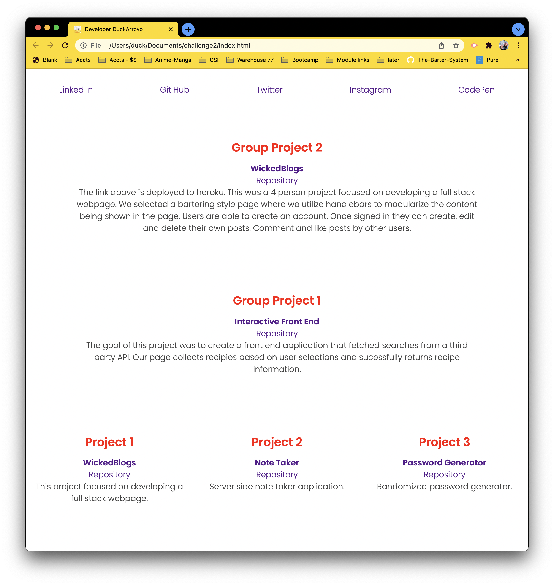

# UO Coding bootcamp - Portfolio

## Links

[Github Page](https://duckarroyo.github.io/portfolio)

[Github Repository](https://github.com/DuckArroyo/portfolio)

[CodePen](https://codepen.io/DeveloperDuckArroyo/pen/ZEJPRvJ)

# Description

Challenge two is a portfolio file. In this project we are collecting the various projects we are working on and providing access to the projects we would like to highlight. This is a no JS project.

# Project Guidelines/Requirements

Create a project that highlights your bootcamp work.

## Required installations for code duplication

There are no dependencies or installations for this project. The link to the live page is above.

## Run server

None

## database and seeds need to be completed

None

# Contributions by:

DeveloperDuckArroyo

<<<<<<< HEAD
[Email](mailto:DeveloperDuckArroyo@gmail.com)

[Portfolio](https://github.com/DuckArroyo/portfolio)

[React Portfolio](http://DuckArroyo.github.io/reactPortfolio)

[GitHub](https://github.com/DuckArroyo)

[Twitter @DevDuckArroyo](https://twitter.com/DevDuckArroyo)

[LinkeIn](https://www.linkedin.com/in/duckarroyo)
=======
[Portfolio](https://duckarroyo.github.io/challenge2/)

[GitHub](https://github.com/DuckArroyo)

[Twitter @DevDuckArroyo](https://twitter.com/DevDuckArroyo)

[LinkeIn](https://www.linkedin.com/in/duckarroyo/)
>>>>>>> 938c5563447177313a1038a68d2175f35881588d

[CodePen](https://codepen.io/DeveloperDuckArroyo)

# Screnshots

